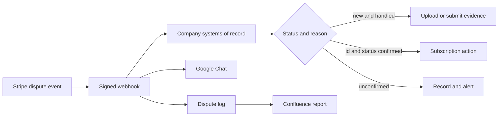
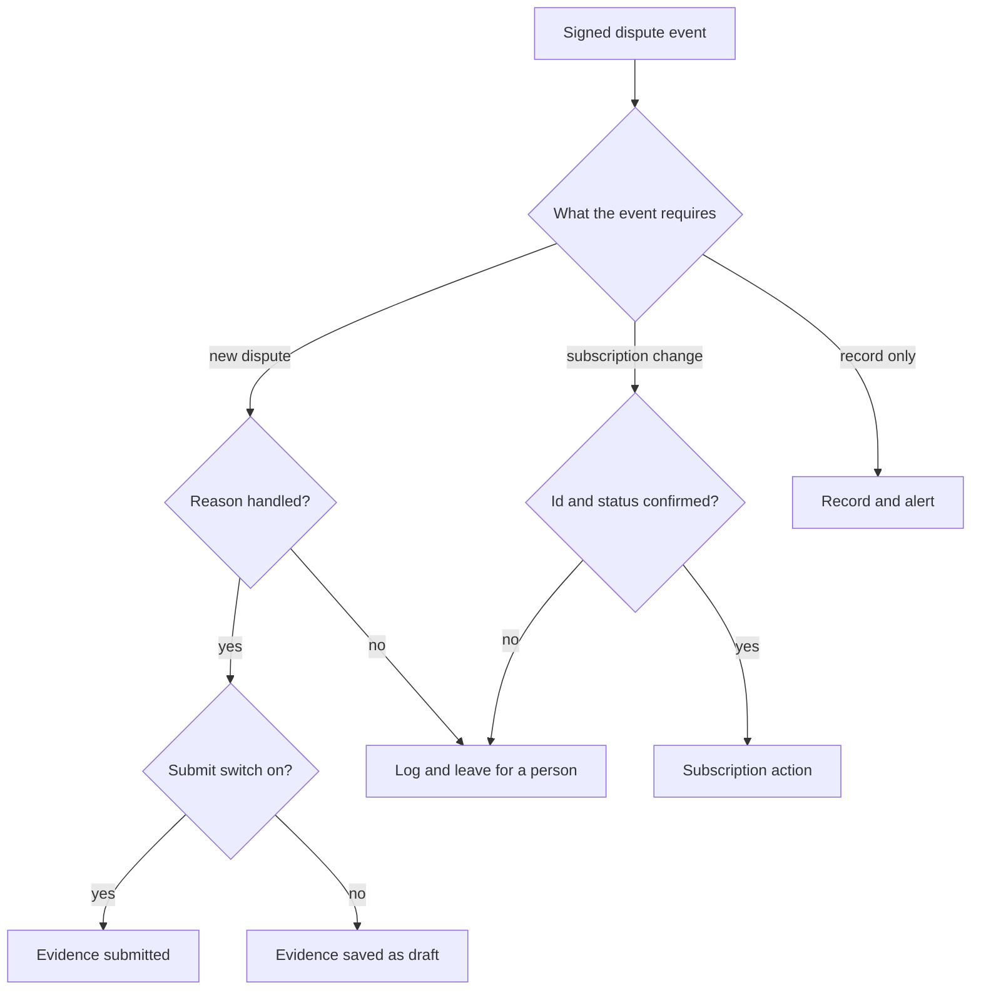

# KOCOWA dispute management — case study

Production Flask service that receives KOCOWA Stripe charge-dispute webhooks, builds evidence from company systems, and can submit that evidence to Stripe. A subscription action runs only when the account match is reliable: a subscription id, and a status read from the subscription service. It does not invent evidence for an unmapped reason, and it does not change a subscription it cannot confirm.

I designed, built, and operate **dispute management** at [wavve Americas](https://www.kocowa.com/) (KOCOWA).

This repository is a **case study only**. It does not contain source code, configs, prompts, or operational data. The production system stays in a private company repository.

**Status:** production service. Evidence covers a subset of Stripe reasons, final submit is a separate switch from upload, and an unconfirmed subscription lookup stays with a person. Not a finished “every dispute is automatic” product.

---

## Problem

KOCOWA sells subscriptions through Stripe. When a cardholder disputes a charge, someone has to answer Stripe with the right evidence, and someone has to decide whether the subscription should change.

Stripe’s event is a poor system of record for either decision. The dispute object does not know the subscription’s state. It does not know what the customer watched, what they agreed to at signup, or what they already told support. Filing a guessed packet can lose the chargeback. Changing a subscription the service cannot confirm can hit the wrong account.

The work needed a signed webhook, evidence assembled from company records, and a check before any subscription change — with everything else left for a person.

## Role

I specified the rules, implemented the service, operate the production Docker host, and decide which dispute reasons may be filed and when a dispute may change a subscription. Billing, entitlement, watch history, and support history come from company systems. The webhook does not infer them from the Stripe payload alone.

## What shipped

- Multi-account Stripe webhook with a signature check per account
- Enrichment from the payment, the internal subscription service, watch history, signup consent, and Zendesk
- Reason-specific evidence: PDFs plus a fixed narrative for each handled reason; unmapped reasons skipped
- A submit switch: save the evidence as a draft, or send the final response to Stripe
- A subscription action only with a subscription id and a status read from the subscription service; a failed or unrecognized lookup stays with a person
- Google Chat alert on each event, a MySQL dispute log, and structured operational logs
- Confluence summary and monthly pages generated from that log
- Docker deploy, and a cleanup job for old evidence PDFs

## Stack

Python, Flask, Gunicorn, Stripe, MySQL, Docker, Zendesk, Google Chat, Confluence.

## Architecture

Flow in words:

1. Stripe posts a dispute event to that account’s webhook. The service checks the signature, then runs the handler.
2. It loads the dispute and the payment, then resolves the KOCOWA subscription, user, product, watch history, signup consent, and Zendesk thread.
3. On a newly created dispute with a handled reason, it builds the evidence packet and either uploads it or submits the response.
4. When the event calls for a subscription change, that action runs only when a subscription id is present and the status was read from the subscription service.
5. When the match is missing or the lookup fails, it records the outcome and asks for a manual check. A dispute that does not call for an account change is recorded and left alone.
6. Every event is written to the dispute log and posted to Google Chat. A reporting job publishes Confluence pages from that log.

The same event can end in three ways:

A dispute can be logged and alerted even when the service takes no Stripe or subscription action. That is intentional: an unmapped reason or a bad match should be visible, and it should stay manual.

| Situation | Source of truth | Typical outcome |
| --- | --- | --- |
| New dispute, handled reason | Stripe event plus account, watch history, policy, and Zendesk | Evidence uploaded, or submitted when the switch is on |
| New dispute, unmapped reason | Stripe reason | Skip evidence. Log it and alert for a person. |
| Subscription change, id and status confirmed | Internal subscription status | Apply the subscription action |
| Subscription change, missing match or failed lookup | Internal subscription status | Leave the subscription. Ask for a manual check. |
| No subscription change required | Stripe status and internal status | Record only |
| Later update of the same dispute | Stripe status | Record the new state. Do not build a second evidence packet. |

Handled reasons are the ones with a defined packet: subscription canceled, product unacceptable, credit not processed, product not received, and general. Other reasons, including fraudulent and unrecognized charges, are skipped.

Hard constraints:

- Live webhooks must pass that account’s signature check
- A subscription action requires a subscription id and a status read from the subscription service
- A failed or unrecognized lookup does not change the subscription
- Never submit evidence for an unmapped reason
- A later update of the same dispute does not rebuild or resubmit evidence

## Operator surface

There is no browser console. Operators watch Google Chat and Confluence. API keys stay on the server.

Google Chat gets one summary per event: reason, status, amount, whether a subscription matched, and the action taken — evidence uploaded, evidence submitted, subscription updated, skipped, or please check manually. A failed subscription action is called out the same way, so a person can finish it.

Confluence is the reporting surface, generated from the dispute log:

| Page | What it shows |
| --- | --- |
| Monthly summary | One row per creation month: totals, how many were appealed, and win/loss only for disputes Stripe has decided |
| Month page | The disputes that belong to that creation month |

A dispute belongs to the month it was created, including when Stripe closes it later. “Appealed” means the service submitted evidence at least once. Fraudulent and unrecognized charges stay in the totals and are not counted as appealed. Under-review cases are left out of win/loss rates.

## Deep dives

### 1. Do not change the wrong subscription

**Situation.** A dispute can call for a change in the subscription system. The payment may not match the account, the lookup may fail, or the status may be one the service is not allowed to act on.

**Constraint.** A subscription change affects the customer’s account. A missing email, a failed lookup, or a status the service does not recognize must not become that change.

**What I built.** A subscription action runs only when two facts are present: a subscription id from the payment, and a status read from the subscription service. If the lookup fails, or the status is not one the service is allowed to act on, it posts a manual-check alert and leaves the subscription in place. Some states need no change: the service records them and does not call the subscription system. A dispute that does not call for an account change is recorded and left alone.

**What changed.** Subscription changes with a reliable match are applied in the subscription system. Everyone else stays as they are until a person looks.

**Walkthrough (invented).** Stripe reports a dispute that calls for a subscription check. The service finds the subscription for that payment and reads its status. An id and a recognized status: it applies the action and the Chat note says so. The same event with no email on the charge, or a subscription lookup that fails: Chat says to check manually, and the subscription stays. A state that needs no change: it records that and stops.

### 2. Evidence comes from company records

**Situation.** A new dispute needs a response: what the customer bought, whether they used it, what they agreed to, and what they already told support.

**Constraint.** Those facts live in company systems. A narrative with no attachments, or a packet for a reason that has no defined fields, is worse than silence. Uploading a draft and submitting a final response are different acts; submit tells Stripe the case is ready for review.

**What I built.** On dispute creation, for a handled reason, the service assembles the fields that reason needs. Watch history, Zendesk comments, signup consent, the cancel log, and the cancellation and refund policy become PDFs. Product description comes from the plan on the payment. A fixed narrative is attached for that reason. Empty fields are omitted. The submit switch then either saves the packet on the dispute or sends it as the response. A later `updated` event records that the draft is sitting there; it does not build the packet again.

**What changed.** Handled disputes leave Stripe with evidence drawn from the account, the activity, and the terms. Operators can run in upload-only until a reason is trusted, then turn submit on without rewriting the packet.

**Walkthrough (invented).** A customer disputes a renewal and says they had already canceled. The reason is subscription canceled, which is handled. The service attaches watch history for that period, the cancellation policy, signup consent, the support thread, and the cancel log, plus the narrative for that reason. With the switch off, Stripe still shows that a response is needed and the files are on the dispute. With the switch on, the response is submitted and the dispute moves to under review. A “product not received” dispute on the same kind of charge attaches access proof instead, because the service is delivered when the payment succeeds.

### 3. Unmapped reasons fail closed

**Situation.** Stripe sends reasons the evidence map does not cover. Fraudulent and unrecognized charges are the common ones, and they often resolve without a merchant packet.

**Constraint.** A partial or generic packet for an unspecified reason can concede the dispute or assert facts the service did not look up. Skipping is safer than improvising.

**What I built.** If the reason has no field list, evidence generation returns immediately. Nothing is uploaded and nothing is submitted. The event is still logged, and Chat says the reason was not handled. The monthly report keeps these disputes in the total and does not mark them appealed.

**What changed.** Automation stays inside the reasons that have a defined packet. New reasons wait until someone specifies the evidence, instead of falling through to a guessed filing.

**Walkthrough (invented).** Stripe opens a dispute with reason fraudulent. The service verifies the webhook, enriches what it can for the log, and stops before any evidence upload. Chat shows the reason and that no packet was sent. A person can still respond in Stripe. The month page counts the dispute. It does not count it as appealed.

## Engineering decisions

| Problem | What landed |
| --- | --- |
| A dispute might change the wrong subscription | A subscription action runs only with a subscription id and a status read from the subscription service. Failed or unrecognized lookups stay manual. |
| Submitting to Stripe before the packet is trusted | Upload and final submit are separate. The switch chooses draft or response. |
| Unmapped reasons still need a filing | Skip. Log and alert. No generic packet. |
| More than one Stripe account | Each account has its own webhook path and signing secret. An unknown account is rejected. |
| Local tests need a way past signature checks | Signature bypass exists only in an explicit test mode. Live traffic is always verified. |
| Operators need to see what happened | Google Chat on each event, a dispute log, and Confluence pages from that log. |
| Evidence PDFs fill the disk | A cleanup job deletes PDFs older than 60 days. |
| The same dispute fires again after upload | Update events record the new status. They do not rebuild or resubmit evidence. |

## Outcomes

Qualitative, and only what I can stand behind:

- The production Docker service is running.
- New disputes on handled reasons get an evidence packet built from the account, watch history, policy, and support history.
- Final submit to Stripe is optional and separate from upload.
- A subscription change runs only when the match is reliable: a subscription id and a status from the subscription service.
- Disputes that do not call for an account change are recorded without one.
- Operators get a Chat alert per event and monthly Confluence summaries from the dispute log.
- Unmapped reasons and unconfirmed matches stay with a person.
